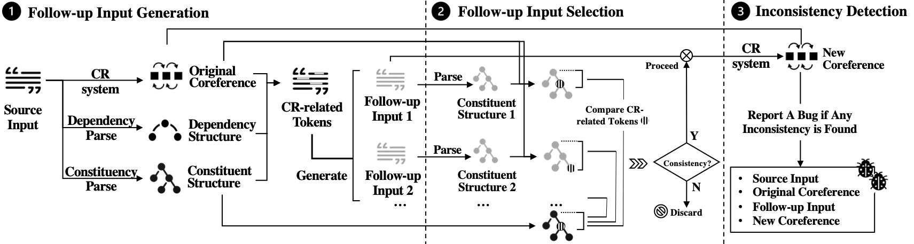

# CREST

This repository is the project for paper-152 **Testing Coreference Resolution Systems without Labeled Test Sets
  Inputs**

## Workflow



## Reproductibility
See [codebook/EasyReproduce.ipynb](./codebook/EasyReproduce.ipynb) for easy reproduction of pipeline of CREST and other baselines

See [codebook/Visualization.ipynb](./codebook/Visualization.ipynb) for visualizing all experiment figures in the paper


**TL;DR**


## Data Available
The repository mainly consists of the following content:
1. Instructions to setup the experiment
2. Code of our tool
3. Code of baselines
4. Test inputs generated by each our work
5. Test inputs generated by baselines
6. Manual labeling results on sampled data
7. Code for visualization of figures in the paper


## Prerequisition

1. Python packages (Run below under `CREST/`):

```shell
pip install -r requirements.txt
```

2. StanfordCoreNLP 4.4.0 or upper
3. Download necessary packages (Run below under `CREST/`):
```shell
git clone https://github.com/conll/reference-coreference-scorers.git
git clone https://github.com/boberle/corefconversion.git
```
4. Launch stanfordcorenlp server:
```shell
java -mx4g -cp "*" edu.stanford.nlp.pipeline.StanfordCoreNLPServer -preload tokenize,ssplit,pos,lemma,ner,parse -status_port 9001 -port 9001
```

## Folder Structure
``` text
.
├── Output                  # Folder including all outputs and labeling
│   ├── RQ1-IssueRevealing  # Results for RQ1
│   │   ├──  generate       # Test inputs generated by each approach
│   │   ├──  label          # Labeled results
│   │   └──  sampled        # Sampled result for labeling
│   ├── RQ2-Quality         # Results for RQ2
│   │   ├──  NeuralCoref    # Results from NeuralCoref
│   │   ├──  Stats          # Results from StatsCR
│   │   ├──  HumanEvaluate  # Folder with source code
│   │   │    ├── sentense_pairs.txt  # 100 sentences used to evaluate
│   │   │    └── CT1/2.jsonl         # Label results from 2 CTs
└────── result_from_prolific.tsv   # Label results from 5 participants from Prolific website
│   │   └──  similarity     # Results of semantic similarity and naturalness difference
│   ├── RQ3-IssueType       # Results for RQ3
│   │   └──  label          # Labeled results
│   ├── RQ4-Parameter       # Results for RQ4
│   │   ├──  NeuralCoref    # Results from NeuralCoref
│   │   ├──  Stats          # Results from StatsCR
│   │   └──  impact.ipynb   # Calculation of impact results
├── rawCoNLL12              # Validation and test set of 
CoNLL12-english-sentence
├── README.md               # This file
├── Figure                  # Folder to store all output figures
├── codebook                # Folder with source code
│   ├── baselines           # Folder with baseline code
│   │   ├──  SIT       
│   │   ├──  CAT       
│   │   ├──  PatInv     
│   │   ├──  README.md      # Instruction of how to set up baselines
│   │   ├──  synonyms.dat   # File to be used by PatInv
│   │   └──  crest_core.py  # Source code of core CREST
│   ├── main .py            # Entry 
│   ├── utils.py            # Source code of some basic functions
│   ├── coref_score.py      # Source code to calculate coreference scores using blanc
│   ├── checkDepth.py       # Source code to check depth of token in parse tree
│   ├── Eval_Sim_Nat.py     # Source code to calculate semantic similarity and naturalness difference
│   ├── EasyReproduce.ipynb # A jupyter notebook to run several examples 
│   └── Visualization.ipynb # A jupyter notebook to visualize all experiment figures in paper
├── LICENSE            
└── requirements.txt    # necessary python packages         

```


